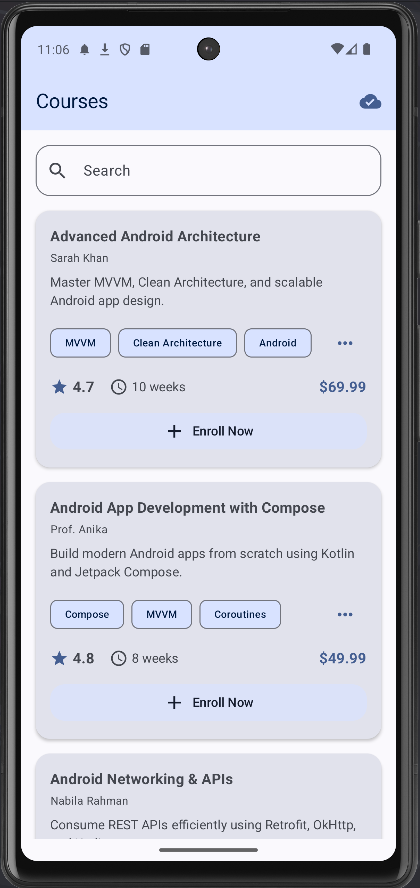
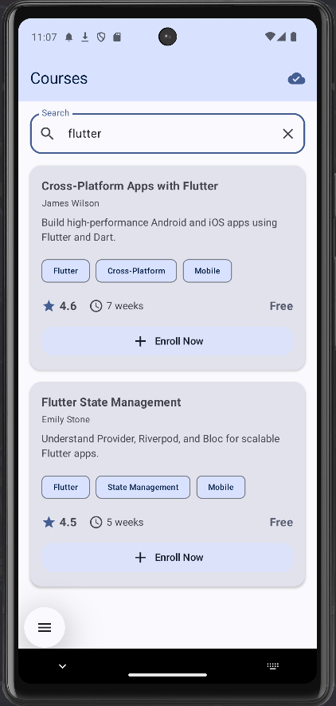
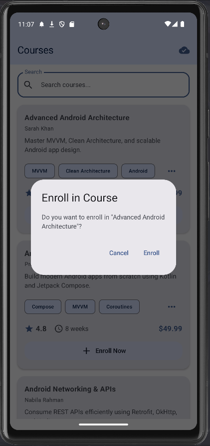
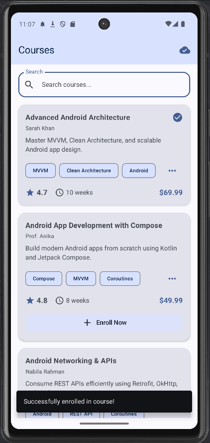
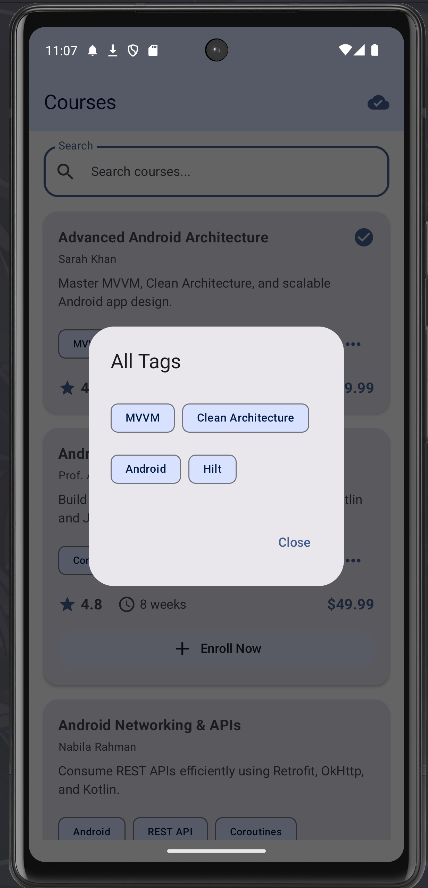
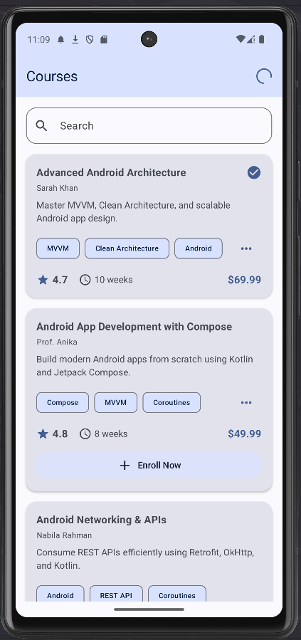
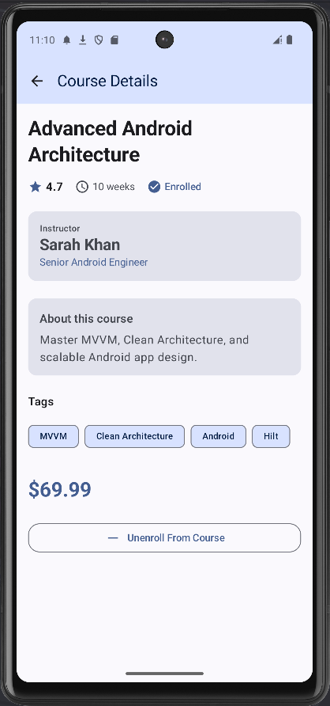
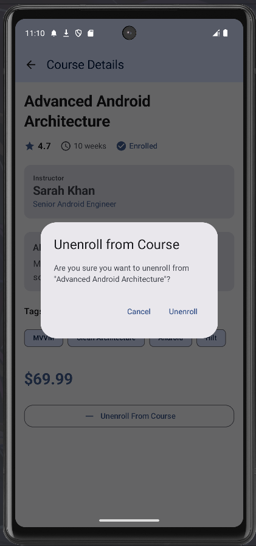
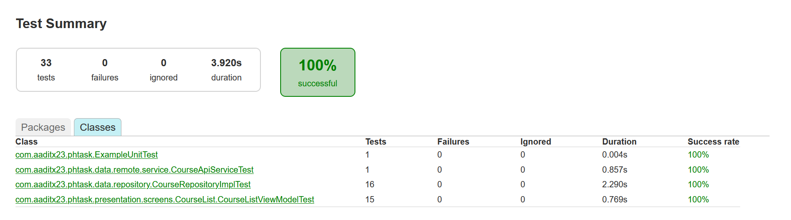
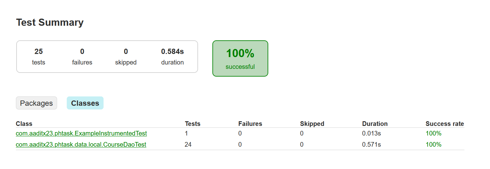

# Programming Hero Android Task - Course App

## Overview
This project was assigned by **Programming Hero** as part of their Android Developer assessment process. The app demonstrates modern Android development practices with a focus on offline-first architecture, clean code, and comprehensive testing.

## 📥 Download
**[Download Latest Release](https://github.com/aaditx23/phtask/releases)** - Get the APK from GitHub Releases

## 🔗 API Information
**Beeceptor API Endpoint:** `https://phtask.free.beeceptor.com/data`
- Base URL: `https://phtask.free.beeceptor.com`
- Endpoint: `/data`

## 📸 Screenshots

|             Screenshot 1             |             Screenshot 2             |             Screenshot 3             |
|:------------------------------------:|:------------------------------------:|:------------------------------------:|
|  |  |  |

|             Screenshot 4             |             Screenshot 5             |             Screenshot 6             |
|:------------------------------------:|:------------------------------------:|:------------------------------------:|
|  |  |  |

|             Screenshot 7             |             Screenshot 8             |             Screenshot 9             |
|:------------------------------------:|:------------------------------------:|:------------------------------------:|
|  |  |  |


|               Screenshot 10                |               Screenshot 11               |
|:------------------------------------------:|:-----------------------------------------:|
|  |  |


## 🎯 Key Features

### Core Functionality
- ✅ **Course List Display** - View all available courses with detailed information
- ✅ **Offline-First Architecture** - Data cached locally, works without internet
- ✅ **Real-time Sync** - Automatic background synchronization with network monitoring
- ✅ **Search & Filter** - Database-level filtering by course title and tags
- ✅ **Course Enrollment** - Mark courses as enrolled with instant UI updates
- ✅ **Network Status Indicator** - Visual feedback for sync status and connectivity
- ✅ **Course Details** - Detailed view with instructor info, pricing, and ratings

### Technical Highlights
- ✅ **Comprehensive Unit and Instrumented Tests** - Covering DAO, Repository, and ViewModel layers
- ✅ **MVVM + Clean Architecture** - Separation of concerns with clear layer boundaries
- ✅ **Jetpack Compose UI** - Modern declarative UI with Material3 design
- ✅ **Coroutines & Flow** - Reactive programming with proper lifecycle management
- ✅ **Room Database** - Local persistence with offline-first strategy
- ✅ **Ktor Client** - Network layer with proper error handling
- ✅ **Koin Dependency Injection** - Modular and testable code structure

## 🏗️ Architecture

```
┌─────────────────────────────────────────────────┐
│              Presentation Layer                 │
│   (Compose UI, ViewModels, UI States)           │
└────────────────┬────────────────────────────────┘
                 │
┌────────────────▼────────────────────────────────┐
│               Domain Layer                      │
│        (Use Cases, Domain Models)               │
└────────────────┬────────────────────────────────┘
                 │
┌────────────────▼────────────────────────────────┐
│                Data Layer                       │
│  (Repository, Room DAO, Ktor API, Mappers)      │
└─────────────────────────────────────────────────┘
```

### Layer Responsibilities

#### **Presentation Layer**
- `CourseListViewModel` - State management and business logic coordination
- `CourseListScreen` - Main UI with search, filtering, and enrollment
- `CourseDetailScreen` - Detailed course information view
- Compose components - Reusable UI components (AppBar, CourseCard, etc.)

#### **Domain Layer**
- Use Cases - Single responsibility operations (GetCourses, SearchCourses, EnrollCourse)
- Domain Models - Pure Kotlin data classes (Course, Instructor)
- Repository Interface - Abstract data operations

#### **Data Layer**
- `CourseRepositoryImpl` - Coordinates Room and API operations
- `CourseDao` - Database queries with Flow-based reactive data
- `CourseApiService` - Network calls with Ktor client
- Mappers - DTO ↔ Entity ↔ Domain conversions
- `NetworkMonitor` - Real-time connectivity tracking


### Testing Tools & Practices
- **MockK** - Mocking dependencies for isolated unit tests
- **Turbine** - Flow testing with proper state assertions
- **Coroutines Test** - StandardTestDispatcher for deterministic testing
- **Room In-Memory Database** - Fast, isolated database tests

### Why Testing Matters
As a QA professional transitioning to Android development, I understand that **untested code is legacy code**. These tests ensure:
- ✅ Refactoring safety - Change code with confidence
- ✅ Regression prevention - Catch bugs before production
- ✅ Documentation - Tests serve as living documentation
- ✅ Code quality - Forces better architecture and testability

## 🧪 Test Coverage

### Unit Tests (32 tests)
- **CourseListViewModelTest** - 15 tests covering state management, search, enrollment, and error handling
- **CourseRepositoryImplTest** - 16 tests for repository operations, caching, and API integration
- **CourseApiServiceTest** - 1 test for network layer data fetching

### Instrumented Tests (24 tests)
- **CourseDaoTest** - 24 tests for database operations, queries, enrollment, and upsert logic

## 🛠️ Tech Stack

### Core Technologies
- **Kotlin** - 100% Kotlin codebase
- **Jetpack Compose** - Modern declarative UI framework
- **Coroutines & Flow** - Asynchronous programming
- **Room Database** - Local data persistence
- **Ktor Client** - HTTP client for API calls
- **Koin** - Dependency injection framework

### Jetpack Libraries
- **ViewModel** - UI state management with lifecycle awareness
- **Navigation Compose** - Type-safe navigation
- **Material3** - Modern Material Design components
- **Lifecycle** - Lifecycle-aware components

### Testing Libraries
- **JUnit4** - Unit testing framework
- **MockK** - Kotlin-first mocking library
- **Turbine** - Flow testing utilities
- **Coroutines Test** - Testing coroutines and flows
- **Room Testing** - In-memory database for tests

## 📱 Features Implementation

### 1. Offline-First Strategy
The repository always reads from the local database first, ensuring the app works offline. Background sync updates the cache when network is available.

### 2. Network Monitoring
Real-time connectivity tracking automatically triggers sync when the device comes online, with visual status indicators for user feedback.

### 3. Database-Level Search
Search and filtering operations are performed at the database layer using SQL queries, ensuring efficient performance even with large datasets.

### 4. Smart Upsert Logic
The upsert mechanism preserves user-specific data (like enrollment status) during sync operations, preventing data loss when refreshing from the API.

## 🚀 Setup & Installation

### Prerequisites
- Android Studio Hedgehog (2023.1.1) or later
- JDK 11 or later
- Android SDK 31+ (minSdk)
- Kotlin 2.2.20

### Running the App
1. Clone the repository
2. Open in Android Studio
3. Sync Gradle dependencies
4. Run the app using `./gradlew installDebug` or the Run button

### Running Tests
- **Unit tests:** `./gradlew testDebugUnitTest`
- **Instrumented tests:** `./gradlew connectedAndroidTest` (requires emulator/device)
- **All tests:** `./gradlew test connectedAndroidTest`

## 📂 Project Structure

The project follows a modular structure organized by layers:

**Data Layer:**
- `data/local/` - Room database, DAOs, and entities
- `data/remote/` - Ktor API service and DTOs
- `data/repository/` - Repository implementations
- `data/mapper/` - Data transformation between layers
- `data/network/` - Network monitoring utilities

**Domain Layer:**
- `domain/model/` - Domain models (Course, Instructor)
- `domain/repository/` - Repository interfaces
- `domain/usecase/` - Business logic use cases

**Presentation Layer:**
- `presentation/screens/` - Compose screens and ViewModels
- `presentation/components/` - Reusable UI components

**Dependency Injection:**
- `di/` - Koin modules for dependency injection

**Tests:**
- `test/` - Unit tests for repository, ViewModel, and API
- `androidTest/` - Instrumented tests for Room DAO

## 🎨 Design Patterns & Best Practices

### Architecture Patterns
- ✅ **MVVM (Model-View-ViewModel)** - Clear separation of UI and business logic
- ✅ **Repository Pattern** - Abstract data sources (local + remote)
- ✅ **Use Case Pattern** - Single responsibility business operations
- ✅ **Dependency Injection** - Loose coupling with Koin
- ✅ **Observer Pattern** - Reactive data with Flow/StateFlow

### Code Quality
- ✅ **Clean Code** - Meaningful names, single responsibility functions
- ✅ **SOLID Principles** - Interface segregation, dependency inversion
- ✅ **Error Handling** - Proper try-catch, Result types, error states
- ✅ **Type Safety** - Sealed classes for states, strong typing
- ✅ **Immutability** - Data classes, val properties, read-only collections

### Android Best Practices
- ✅ **Lifecycle Awareness** - ViewModelScope, lifecycle-aware collections
- ✅ **Configuration Changes** - ViewModel survives rotation
- ✅ **Memory Leaks Prevention** - Proper coroutine cancellation
- ✅ **Efficient Database** - Flow-based reactive queries, proper indexing
- ✅ **Network Efficiency** - Caching, offline-first, background sync

## 📊 Performance Optimizations

- **Database Indexing** - Primary key on `course_id` for fast lookups
- **Flow-based Queries** - Reactive data updates without manual refresh
- **Background Threading** - All IO operations on Dispatchers.IO
- **StateFlow Caching** - `stateIn()` with WhileSubscribed(5000) for lifecycle-aware caching
- **Lazy Loading** - Only fetch data when needed
- **Smart Upsert** - Preserves local state during sync

## 🔐 Error Handling

### Network Errors
The app uses sealed interfaces to represent different sync states including idle, syncing, success, network errors, and device offline status.

### Repository Error Handling
All repository operations return Result types with proper error handling using try-catch blocks and coroutine exception handling.

## 🎓 About the Developer

**Background:** QA Professional at Brain Station 23 transitioning to Android Development

**Why This Project Stands Out:**
- As a QA professional, I understand the critical importance of testable, maintainable code
- Comprehensive tests demonstrate production-level quality assurance
- Offline-first architecture shows understanding of real-world app requirements
- Clean architecture ensures scalability and maintainability

**What I Bring:**
- ✅ Testing discipline from QA experience
- ✅ Modern Android development skills (Compose, Coroutines, MVVM)
- ✅ Understanding of software quality and best practices
- ✅ Passion for writing clean, testable code

## 📝 Task Requirements Checklist

### ✅ Core Requirements
- [x] Fetch courses from Beeceptor API using Ktor
- [x] Display course list with Jetpack Compose
- [x] Implement offline-first with Room database
- [x] Background sync when network available
- [x] Search/filter at database layer
- [x] Mark courses as enrolled with DB update
- [x] Navigate to course detail screen
- [x] MVVM architecture with Repository pattern
- [x] Dependency injection (Koin)
- [x] Coroutines and Flow for async operations

### ✅ Bonus Features
- [x] Comprehensive unit tests
- [x] Network status monitoring with visual feedback
- [x] Smart upsert preserving local state
- [x] Error handling with user-friendly messages
- [x] Material3 design with polished UI
- [x] Proper state management with sealed classes
- [x] Clean architecture with clear layer separation
